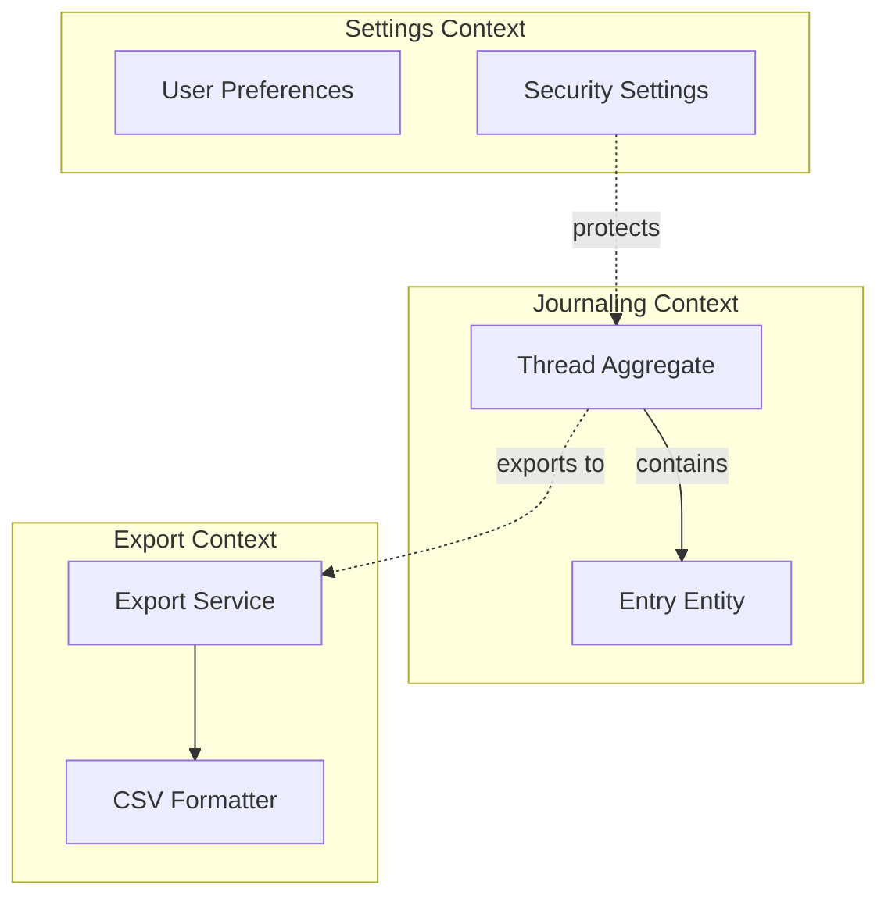
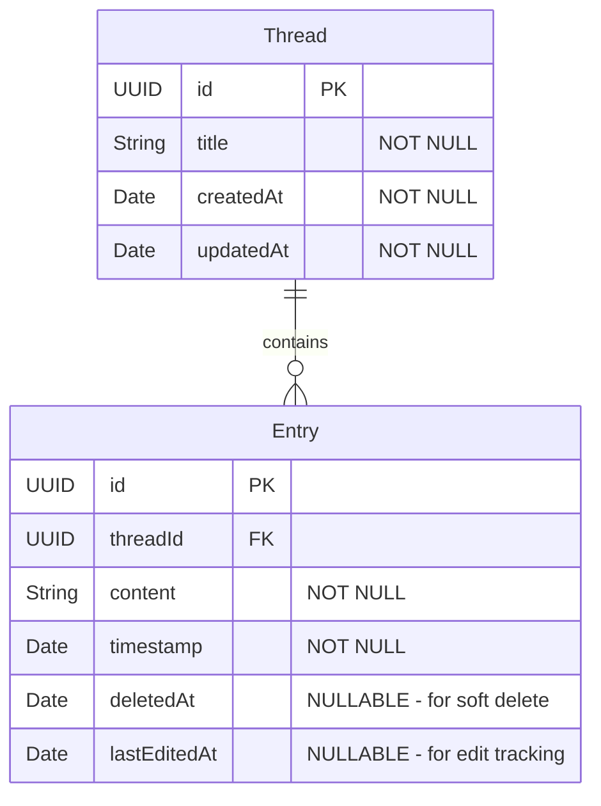
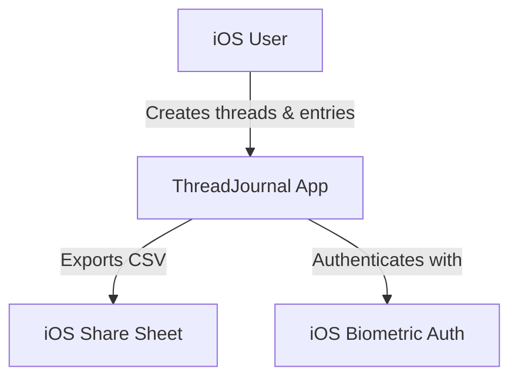
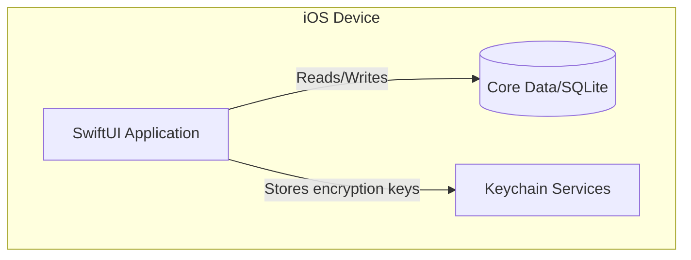
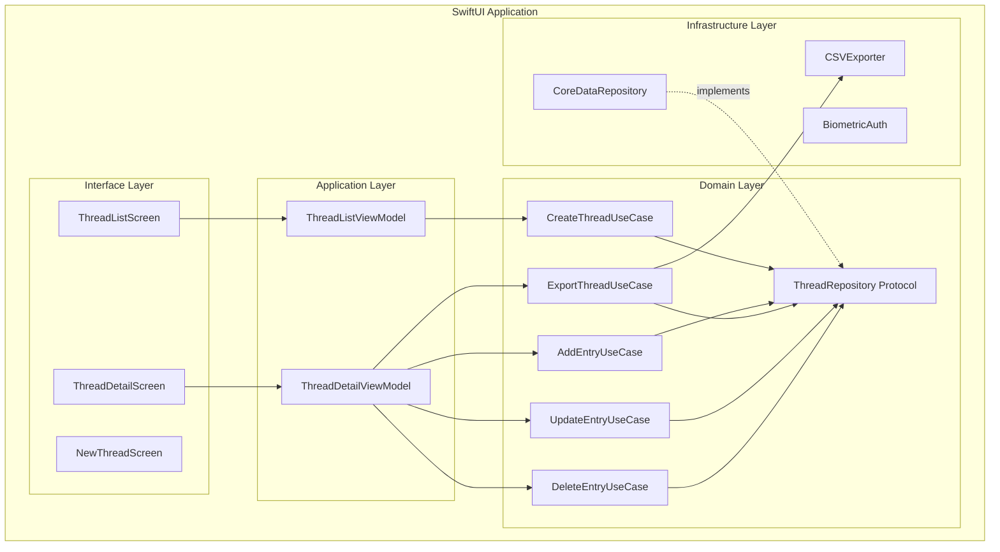
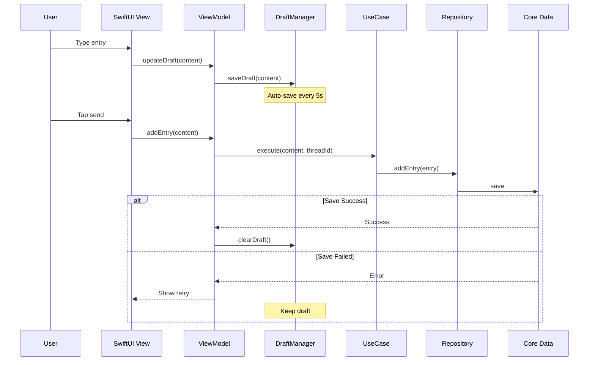
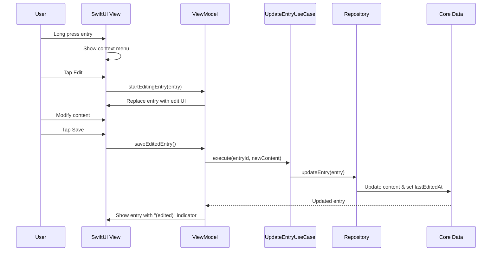
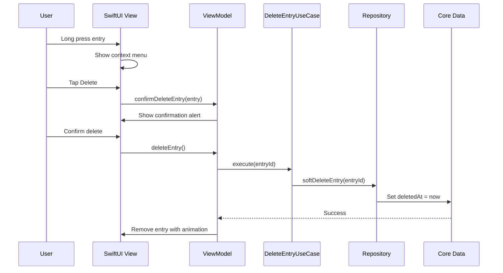
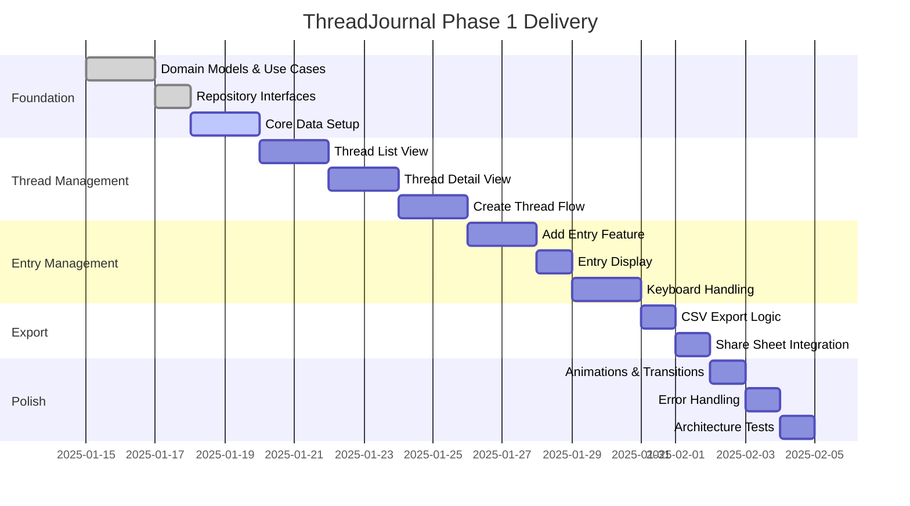

# ThreadJournal Technical Architecture & Implementation Plan (TIP)

## Executive Summary
ThreadJournal is a minimalist, local-first iOS journaling application that organizes thoughts into continuous threads. This TIP provides comprehensive technical guidance for implementing the system with maintainable, modular architecture that prevents code degradation.

## 1. Requirement Deep-Dive & Assumption Validation

### Core Requirements Analysis (ISO/IEC 25010 Mapping)
| Quality Attribute | Requirement | Priority | Validation |
|------------------|-------------|----------|------------|
| **Functionality** | Thread-based journaling with chronological entries | Critical | ✓ Clearly defined in tickets |
| **Usability** | Minimalist UI, left-aligned text, Dynamic Type | Critical | ✓ Design specs provided |
| **Performance** | Support 100+ threads, 1000+ entries per thread | High | ✓ Simple load-all approach |
| **Reliability** | Draft protection, retry on failure | High | ✓ Auto-save in memory |
| **Maintainability** | Clean architecture, LLM-friendly code | Critical | ✓ Focus of this TIP |
| **Portability** | iOS-first, potential iPad support | Low | ✓ SwiftUI enables this |

### ADR-000: Scope & Constraints
**Status**: Accepted  
**Context**: Building a personal journaling app with strict architectural boundaries  
**Decision**: 
- Scope limited to Phase 1 features only
- No cloud sync, authentication, or social features
- Local SQLite/Core Data for persistence
- SwiftUI-only implementation
- Max 200 LOC per file, 15 LOC per method

**Constraints**:
- iOS 17+ requirement for latest SwiftUI features
- No third-party analytics or crash reporting
- CSV export via native share sheet only
- Phase 1 focuses on core journaling only

## 2. Domain & Data Modeling (DDD + ERD)

### Domain Model & Context Map



### Entity-Relationship Diagram



### Ubiquitous Language
- **Thread**: A continuous conversation/journal on a specific topic
- **Entry**: A single timestamped thought within a thread
- **Compose**: The act of adding a new entry to a thread

## 3. Code Organization & Maintainability Guardrails

### Clean Architecture Layers

```
ThreadJournal/
├── Domain/                 # Business logic (no dependencies)
│   ├── Entities/
│   │   ├── Thread.swift
│   │   └── Entry.swift
│   ├── UseCases/
│   │   ├── CreateThreadUseCase.swift
│   │   ├── AddEntryUseCase.swift
│   │   ├── ExportThreadUseCase.swift
│   │   ├── UpdateEntryUseCase.swift
│   │   └── DeleteEntryUseCase.swift
│   └── Repositories/       # Interfaces only
│       └── ThreadRepository.swift
│
├── Application/            # Use case orchestration
│   ├── Presenters/
│   │   ├── ThreadListPresenter.swift
│   │   └── ThreadDetailPresenter.swift
│   └── ViewModels/
│       ├── ThreadListViewModel.swift
│       └── ThreadDetailViewModel.swift
│
├── Interface/              # UI Layer (SwiftUI)
│   ├── Screens/
│   │   ├── ThreadListScreen.swift
│   │   └── ThreadDetailScreen.swift
│   ├── Components/
│   │   ├── ThreadListItem.swift
│   │   ├── ThreadEntry.swift
│   │   └── ComposeArea.swift
│   └── Theme/
│       └── DesignSystem.swift
│
└── Infrastructure/         # External dependencies
    ├── Persistence/
    │   ├── CoreDataThreadRepository.swift
    │   └── ThreadDataModel.xcdatamodeld
    ├── Export/
    │   └── CSVExporter.swift
    └── Security/
        └── BiometricAuthService.swift
```

### Dependency Rules (SOLID Enforcement)
1. **Dependency Direction**: Infrastructure → Interface → Application → Domain
2. **Interface Segregation**: Each protocol has single responsibility
3. **Dependency Injection**: Constructor injection only, NO singletons
4. **Open/Closed**: New features via new use cases, not modification
5. **Future-Proofing**: Design supports Phase 2/3 features without breaking changes

### Automated Architecture Enforcement

#### SwiftLint Configuration (.swiftlint.yml)
```yaml
line_length: 100
file_length:
  warning: 200
  error: 250
function_body_length:
  warning: 15
  error: 20
type_body_length:
  warning: 150
  error: 200
cyclomatic_complexity:
  warning: 5
  error: 10
custom_rules:
  no_domain_imports:
    regex: 'import (UIKit|SwiftUI|CoreData)'
    match_kinds: keyword
    message: "Domain layer cannot import UI or Infrastructure"
    severity: error
    excluded:
      - "*/Infrastructure/*"
      - "*/Interface/*"
```

#### Architecture Tests (Using Quick/Nimble)
```swift
class ArchitectureTests: QuickSpec {
    override func spec() {
        describe("Clean Architecture") {
            it("Domain has no external dependencies") {
                let domainImports = scanImports(in: "Domain/")
                expect(domainImports).toNot(contain("UIKit", "SwiftUI", "CoreData"))
            }
            
            it("Use cases have single responsibility") {
                let useCases = findClasses(in: "Domain/UseCases/")
                useCases.forEach { useCase in
                    expect(useCase.publicMethods.count).to(equal(1))
                }
            }
        }
    }
}
```

## 4. System Architecture (C4 Model)

### C1: System Context


### C2: Container Diagram


### C3: Component Diagram


## 5. Technology & Pattern Selection (ATAM + ADR-001)

### ADR-001: Architecture Style & Stack
**Status**: Accepted  
**Context**: Need maintainable, testable architecture for iOS app  
**Options Evaluated**:
1. MVC - Too tightly coupled for complex features
2. MVVM - Good but insufficient for clean boundaries
3. VIPER - Overly complex for our scope
4. **Clean Architecture + MVVM** - Best balance ✓

**Decision**: Clean Architecture with MVVM presentation layer
- **Language**: Swift 5.9
- **UI**: SwiftUI (iOS 17+)
- **Persistence**: Core Data with SQLite (versioned from day 1)
- **Security**: iOS file protection only (Phase 1)
- **Testing**: XCTest
- **DI**: Manual constructor injection

**Impact on Maintainability**:
- Clear separation of concerns
- Testable business logic
- Easy to add new features
- LLM-friendly bounded contexts

## 6. API & Contract Design

### Internal API Contracts (Domain Layer)

```swift
// ThreadRepository.swift
protocol ThreadRepository {
    func create(thread: Thread) async throws
    func update(thread: Thread) async throws
    func delete(threadId: UUID) async throws
    func fetch(threadId: UUID) async throws -> Thread?
    func fetchAll() async throws -> [Thread]
    func addEntry(_ entry: Entry, to threadId: UUID) async throws
    func updateEntry(_ entry: Entry) async throws
    func softDeleteEntry(entryId: UUID) async throws
    func fetchEntries(for threadId: UUID, includeDeleted: Bool) async throws -> [Entry]
}

// Use Case Protocols
protocol CreateThreadUseCase {
    func execute(title: String, firstEntry: String?) async throws -> Thread
}

protocol AddEntryUseCase {
    func execute(content: String, threadId: UUID) async throws -> Entry
}

protocol ExportThreadUseCase {
    func execute(threadId: UUID) async throws -> ExportData
}

protocol UpdateEntryUseCase {
    func execute(entryId: UUID, newContent: String) async throws -> Entry
}

protocol DeleteEntryUseCase {
    func execute(entryId: UUID) async throws
}

// Export Protocol for future formats
protocol ExportData {
    var filename: String { get }
    var data: Data { get }
    var mimeType: String { get }
}
```

### View Model Contracts

```swift
// ThreadListViewModel.swift
@MainActor
protocol ThreadListViewModelProtocol: ObservableObject {
    var threads: [ThreadListItem] { get }
    var isLoading: Bool { get }
    var error: Error? { get }
    
    func loadThreads() async
    func createThread(title: String) async
}

// ThreadDetailViewModel.swift  
@MainActor
protocol ThreadDetailViewModelProtocol: ObservableObject {
    var thread: Thread? { get }
    var entries: [Entry] { get }
    var isLoading: Bool { get }
    var draftContent: String { get set }
    var isSavingDraft: Bool { get }
    var editingEntry: Entry? { get }
    var editingContent: String { get set }
    var entryToDelete: Entry? { get }
    var showDeleteConfirmation: Bool { get }
    
    func loadThread(id: UUID) async
    func addEntry(content: String) async
    func saveDraft() async
    func exportToCSV() async throws -> URL
    func startEditingEntry(_ entry: Entry)
    func saveEditedEntry() async
    func cancelEditing()
    func confirmDeleteEntry(_ entry: Entry)
    func deleteEntry() async
}
```

## 7. Data Flow, Privacy & Compliance

### Data Flow Diagram


### Edit Entry Flow


### Delete Entry Flow


### Privacy & Security Controls (NIST 800-53)
| Control | Implementation |
|---------|---------------|
| **AC-7** | Deferred to Phase 2 |
| **SC-28** | iOS file protection (default) |
| **SC-12** | Deferred to Phase 3 |
| **AU-11** | No analytics or logging of user content |
| **MP-6** | Local storage only, no cloud backup |

## 8. Scalability & Performance Budget

### Performance Targets
| Metric | Target | Measurement |
|--------|--------|-------------|
| App Launch | < 1s | Time to thread list display |
| Thread List Load | < 200ms | 100+ threads |
| Thread Load | < 300ms | 1000 entries |
| Entry Creation | < 50ms | Time to persist and display |
| CSV Export | < 3s | 1000 entries (~250KB) |
| Memory Usage | < 150MB | 100 threads with 1000 entries each |

### Scaling Strategy
- Load all entries at once (no pagination needed)
- ~250KB for 1000 entries is minimal
- Monitor performance, optimize only if needed
- CSV export chunks if file > 10MB

## 9. Core Data Migration Strategy

### Version 1.0 → 1.1 Migration
**Changes**:
- Add `deletedAt` (Date, Optional) to CDEntry entity
- Add `lastEditedAt` (Date, Optional) to CDEntry entity

**Migration Type**: Lightweight (automatic)

**Migration Steps**:
1. Create new model version: ThreadDataModel v1.1
2. Set v1.1 as current model version
3. Add new attributes with Optional setting
4. Core Data handles migration automatically

**Code Implementation**:
```swift
// Entry entity updates
extension Entry {
    var isDeleted: Bool {
        deletedAt != nil
    }
    
    var isEdited: Bool {
        lastEditedAt != nil
    }
    
    var displayTimestamp: String {
        if let lastEditedAt = lastEditedAt {
            return "\(formattedDate) (edited)"
        }
        return formattedDate
    }
}
```

**Testing Migration**:
1. Install app with v1.0 schema
2. Create test data (threads and entries)
3. Update to v1.1 schema
4. Verify existing data preserved
5. Verify new fields default to nil

### Future Migration Considerations
- Keep lightweight migrations when possible
- Document each version's changes
- Test with production-like data volumes
- Consider migration performance for large datasets

## 10. Dev Ops & CI/CD Pipeline

### GitOps Workflow
```yaml
# .github/workflows/ci.yml
name: CI
on: [push, pull_request]

jobs:
  lint:
    runs-on: macos-latest
    steps:
      - uses: actions/checkout@v3
      - run: swiftlint --strict
      
  architecture:
    runs-on: macos-latest
    steps:
      - uses: actions/checkout@v3
      - run: swift test --filter ArchitectureTests
      
  test:
    runs-on: macos-latest
    steps:
      - uses: actions/checkout@v3
      - run: xcodebuild test -scheme ThreadJournal
      
  build:
    runs-on: macos-latest
    steps:
      - uses: actions/checkout@v3
      - run: xcodebuild build -scheme ThreadJournal
```

### Secrets Management
- Use GitHub Secrets for signing certificates
- Keychain Access for local development
- No hardcoded keys in source

## 11. Observability & SRE Practices

### SLIs/SLOs
| SLI | SLO | Measurement |
|-----|-----|-------------|
| Crash-free rate | 99.9% | Via TestFlight/App Store |
| Entry save success | 99.99% | With retry logic |
| Draft recovery | 100% | In-memory until saved |
| Export success | 99% | User feedback |

### Logging Strategy
```swift
// Phase 1: Debug logging only, no PII
#if DEBUG
print("[ThreadJournal] Action: \(action) Success: \(success)")
#endif
// Phase 3: Add privacy-preserving telemetry
```

## 12. Security Threat Model (STRIDE)

| Threat | Category | Phase 1 Mitigation | Future Mitigation |
|--------|----------|-------------------|-------------------|
| Unauthorized access | **E**levation of privilege | iOS device lock | Phase 2: FaceID |
| Data theft from backup | **I**nformation disclosure | iOS file protection | Phase 3: Encryption |
| Malicious CSV injection | **T**ampering | Escape quotes in CSV | - |
| Shoulder surfing | **I**nformation disclosure | - | Phase 2: Hide on background |

## 13. Delivery Roadmap

### Epic Breakdown


## 13. Cost Estimation

### Development Costs (Phase 1: 2-week sprint)
- 1 Senior iOS Developer: $10,000
- Code review & architecture: $2,000
- Testing & QA: $2,000
- **Total**: $14,000

### Operational Costs (Monthly)
- App Store fees: $0 (covered by developer account)
- No server costs (local-first)
- TestFlight distribution: $0
- **Total**: $0/month

### Future Phase Estimates
- Phase 2 (Edit/Delete, iCloud): 2 weeks, $14,000
- Phase 3 (Security, Tags, Speech): 3 weeks, $21,000

## 15. LLM Implementation Guardrails

### Swift Protocol Templates
```swift
// TEMPLATE: Use Case Implementation
final class Create{Entity}UseCase: Create{Entity}UseCaseProtocol {
    private let repository: {Entity}Repository
    
    // RULE: Constructor injection only
    init(repository: {Entity}Repository) {
        self.repository = repository
    }
    
    // RULE: Single public method
    func execute(/* params */) async throws -> {Entity} {
        // RULE: Max 15 lines
        // Business logic here
    }
}

// TEMPLATE: Draft Manager
protocol DraftManager {
    func saveDraft(_ content: String, for threadId: UUID)
    func getDraft(for threadId: UUID) -> String?
    func clearDraft(for threadId: UUID)
}

final class InMemoryDraftManager: DraftManager {
    private var drafts: [UUID: String] = [:]
    private var saveTimer: Timer?
    
    func saveDraft(_ content: String, for threadId: UUID) {
        drafts[threadId] = content
        // Auto-save timer logic
    }
}

// TEMPLATE: Repository Implementation  
final class CoreData{Entity}Repository: {Entity}Repository {
    private let context: NSManagedObjectContext
    
    init(context: NSManagedObjectContext) {
        self.context = context
    }
    
    // RULE: Each method < 15 lines
    // RULE: No business logic
}
```

### Anti-Pattern Detection Rules
1. **NO God Objects**: Classes > 200 lines trigger error
2. **NO Singletons**: Pattern `.shared` banned in linter
3. **NO Circular Dependencies**: Architecture tests enforce
4. **NO Mixed Concerns**: UI code in Domain layer fails build
5. **NO Force Unwrapping**: `!` operator triggers warning

### Testing Boundaries
```swift
// RULE: Domain tests know nothing about UI/Infrastructure
class ThreadUseCaseTests: XCTestCase {
    func testCreateThread() async throws {
        // GIVEN - mock repository only
        let mockRepo = MockThreadRepository()
        let useCase = CreateThreadUseCase(repository: mockRepo)
        
        // WHEN - pure business logic
        let thread = try await useCase.execute(title: "Test")
        
        // THEN - domain assertions only
        XCTAssertEqual(thread.title, "Test")
    }
}

// Performance test for 1000 entries
func testPerformanceWith1000Entries() {
    measure {
        // Load thread with 1000 entries
        // Should complete < 300ms
    }
}
```

## Implementation Guardrails Summary

### Phase 1 Scope Enforcement
- NO edit/delete functionality
- NO security/encryption beyond iOS defaults
- NO settings or preferences
- YES draft protection
- YES performance for 100+ threads, 1000+ entries

### Folder Structure Enforcement
- Domain layer: No UI imports allowed
- Max file length: 200 lines  
- Max method length: 15 lines
- Required protocols for all use cases

### Dependency Rules
- Constructor injection required
- No static dependencies
- Protocols define all boundaries
- Mock implementations for all protocols

### CI/CD Gates
1. SwiftLint must pass (strict mode)
2. Architecture tests must pass
3. Performance tests must pass
4. No merge without review

## Next-Step Checklist

- [ ] Set up Xcode project with folder structure
- [ ] Configure SwiftLint with rules
- [ ] Create domain entities (Thread, Entry only)
- [ ] Implement Core Data models with schema version
- [ ] Build CreateThreadUseCase with tests
- [ ] Implement DraftManager for auto-save
- [ ] Create thread list view with view model
- [ ] Add performance tests (100 threads, 1000 entries)
- [ ] Implement CSV export with proper escaping
- [ ] Configure GitHub Actions CI
- [ ] Test draft recovery and retry logic