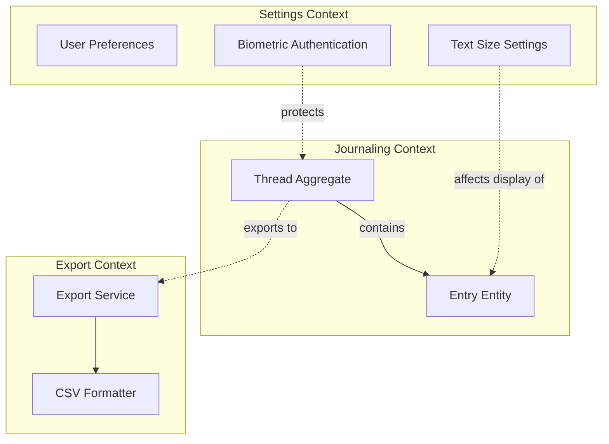
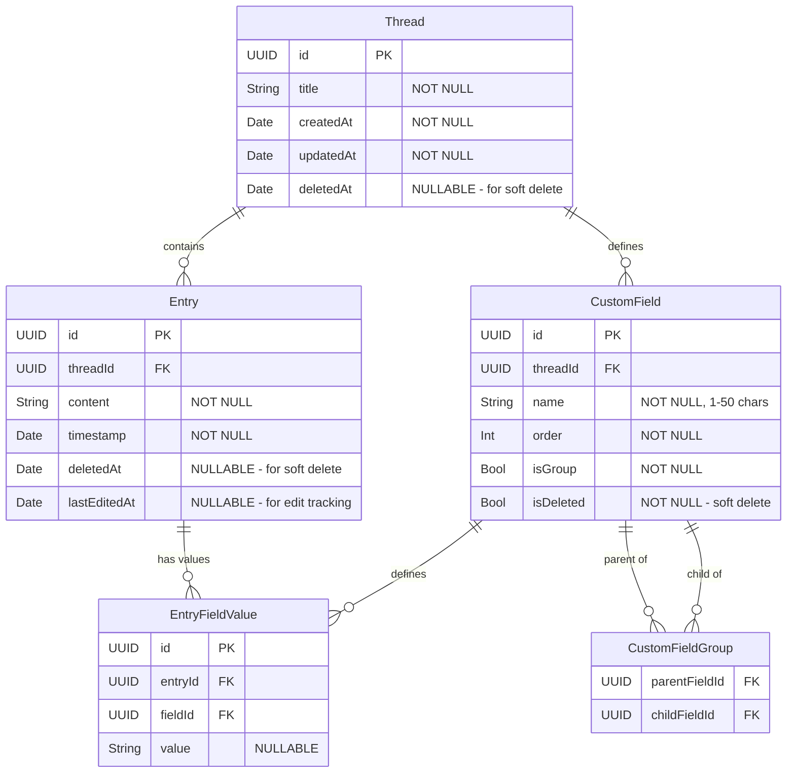
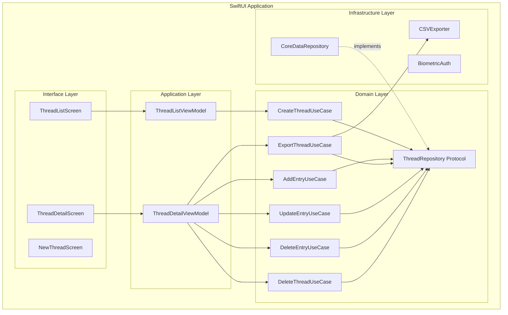
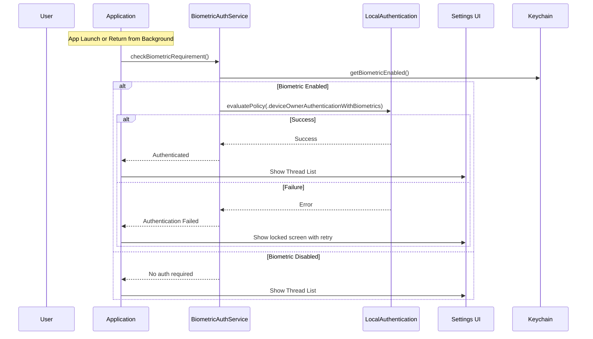
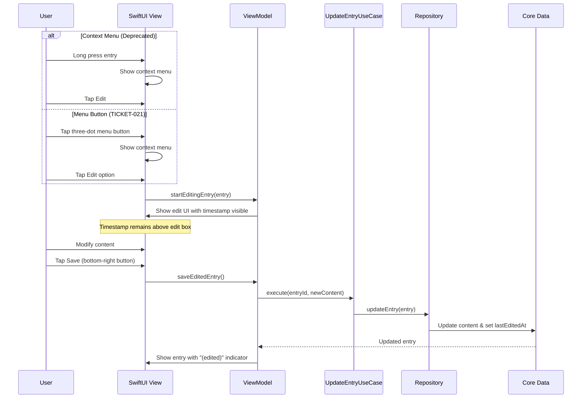
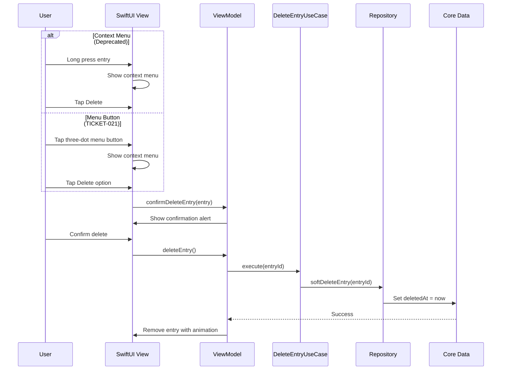
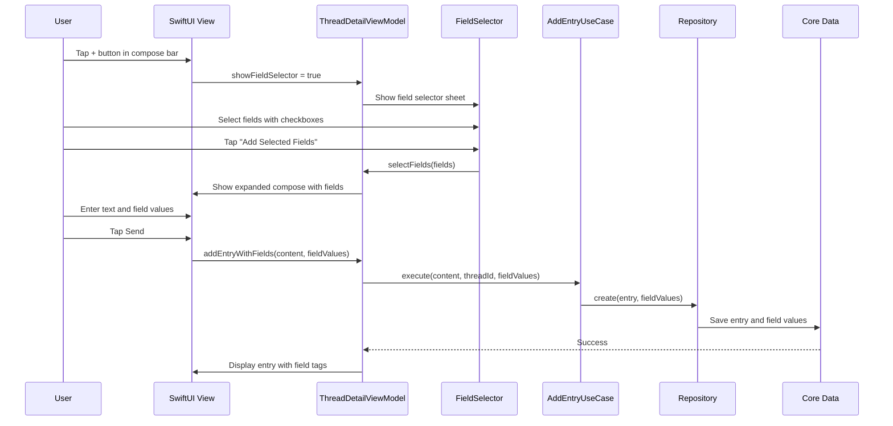
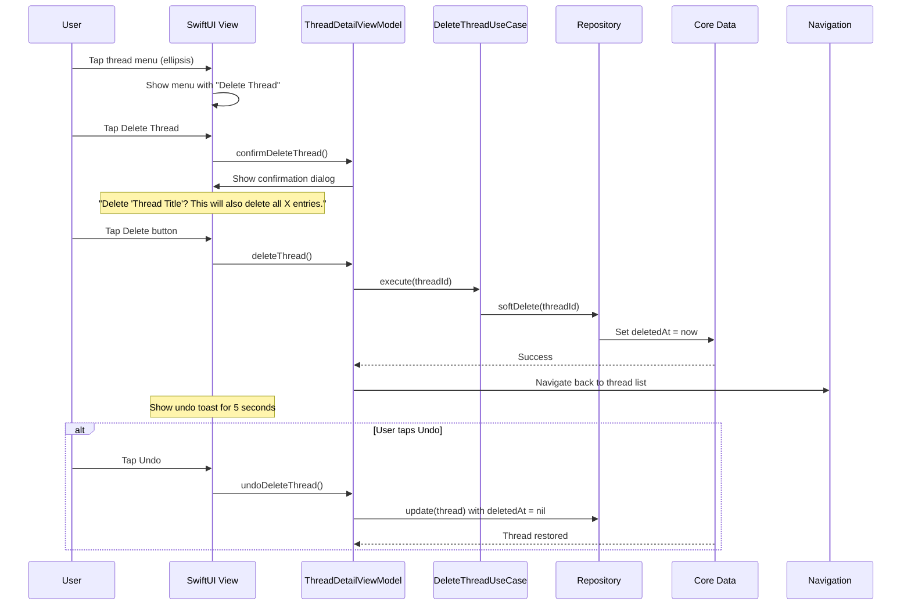

# ThreadJournal Technical Architecture & Implementation Plan (TIP)

## Executive Summary
ThreadJournal is a minimalist, local-first iOS journaling application that organizes thoughts into continuous threads. This TIP provides comprehensive technical guidance for implementing the system with maintainable, modular architecture that prevents code degradation.

## 1. Requirement Deep-Dive & Assumption Validation

### Core Requirements Analysis (ISO/IEC 25010 Mapping)
| Quality Attribute | Requirement | Priority | Validation |
|------------------|-------------|----------|------------|
| **Functionality** | Thread-based journaling with chronological entries | Critical | ✓ Clearly defined in tickets |
| **Usability** | Minimalist UI, left-aligned text, Dynamic Type | Critical | ✓ Design specs provided |
| **Performance** | Support 100+ threads, 1000+ entries per thread | High | ✓ Simple load-all approach |
| **Reliability** | Draft protection, retry on failure | High | ✓ Auto-save in memory |
| **Maintainability** | Clean architecture, LLM-friendly code | Critical | ✓ Focus of this TIP |
| **Portability** | iOS-first, potential iPad support | Low | ✓ SwiftUI enables this |

### ADR-000: Scope & Constraints
**Status**: Accepted  
**Context**: Building a personal journaling app with strict architectural boundaries  
**Decision**: 
- Scope limited to Phase 1 features only
- No cloud sync, authentication, or social features
- Local SQLite/Core Data for persistence
- SwiftUI-only implementation
- Max 200 LOC per file, 15 LOC per method

**Constraints**:
- iOS 17+ requirement for latest SwiftUI features
- No third-party analytics or crash reporting
- CSV export via native share sheet only
- Phase 1 focuses on core journaling only

## 2. Domain & Data Modeling (DDD + ERD)

### Domain Model & Context Map



### Entity-Relationship Diagram



### Ubiquitous Language
- **Thread**: A continuous conversation/journal on a specific topic
- **Entry**: A single timestamped thought within a thread
- **Compose**: The act of adding a new entry to a thread
- **Custom Field**: A structured data field that can be attached to entries
- **Field Group**: A collection of related fields displayed together
- **Field Value**: The data entered for a specific field on an entry

## 3. Code Organization & Maintainability Guardrails

### Clean Architecture Layers

```
ThreadJournal/
├── Domain/                 # Business logic (no dependencies)
│   ├── Entities/
│   │   ├── Thread.swift
│   │   ├── Entry.swift
│   │   ├── CustomField.swift
│   │   ├── CustomFieldGroup.swift
│   │   └── EntryFieldValue.swift
│   ├── UseCases/
│   │   ├── CreateThreadUseCase.swift
│   │   ├── AddEntryUseCase.swift
│   │   ├── ExportThreadUseCase.swift
│   │   ├── UpdateEntryUseCase.swift
│   │   ├── DeleteEntryUseCase.swift
│   │   ├── DeleteThreadUseCase.swift
│   │   ├── CreateCustomFieldUseCase.swift
│   │   ├── CreateFieldGroupUseCase.swift
│   │   └── DeleteCustomFieldUseCase.swift
│   └── Repositories/       # Interfaces only
│       ├── ThreadRepository.swift
│       └── EntryRepository.swift
│
├── Application/            # Use case orchestration
│   ├── Presenters/
│   │   ├── ThreadListPresenter.swift
│   │   └── ThreadDetailPresenter.swift
│   └── ViewModels/
│       ├── ThreadListViewModel.swift
│       ├── ThreadDetailViewModel.swift
│       ├── CustomFieldsViewModel.swift
│       └── FieldSelectorViewModel.swift
│
├── Interface/              # UI Layer (SwiftUI)
│   ├── Screens/
│   │   ├── ThreadListScreen.swift
│   │   ├── ThreadDetailScreen.swift
│   │   ├── SettingsScreen.swift
│   │   └── CustomFieldsScreen.swift
│   ├── Components/
│   │   ├── ThreadListItem.swift
│   │   ├── ThreadEntry.swift
│   │   ├── ComposeArea.swift
│   │   ├── SettingsRow.swift
│   │   ├── FieldSelector.swift
│   │   ├── FieldInput.swift
│   │   └── FieldTag.swift
│   └── Theme/
│       └── DesignSystem.swift
│
└── Infrastructure/         # External dependencies
    ├── Persistence/
    │   ├── CoreDataThreadRepository.swift
    │   └── ThreadDataModel.xcdatamodeld
    ├── Export/
    │   └── CSVExporter.swift
    └── Security/
        └── BiometricAuthService.swift
```

### Dependency Rules (SOLID Enforcement)
1. **Dependency Direction**: Infrastructure → Interface → Application → Domain
2. **Interface Segregation**: Each protocol has single responsibility
3. **Dependency Injection**: Constructor injection only, NO singletons
4. **Open/Closed**: New features via new use cases, not modification
5. **Future-Proofing**: Design supports Phase 2/3 features without breaking changes

### Automated Architecture Enforcement

#### SwiftLint Configuration (.swiftlint.yml)
```yaml
line_length: 100
file_length:
  warning: 200
  error: 250
function_body_length:
  warning: 15
  error: 20
type_body_length:
  warning: 150
  error: 200
cyclomatic_complexity:
  warning: 5
  error: 10
custom_rules:
  no_domain_imports:
    regex: 'import (UIKit|SwiftUI|CoreData)'
    match_kinds: keyword
    message: "Domain layer cannot import UI or Infrastructure"
    severity: error
    excluded:
      - "*/Infrastructure/*"
      - "*/Interface/*"
```

#### Architecture Tests (Using Quick/Nimble)
```swift
class ArchitectureTests: QuickSpec {
    override func spec() {
        describe("Clean Architecture") {
            it("Domain has no external dependencies") {
                let domainImports = scanImports(in: "Domain/")
                expect(domainImports).toNot(contain("UIKit", "SwiftUI", "CoreData"))
            }
            
            it("Use cases have single responsibility") {
                let useCases = findClasses(in: "Domain/UseCases/")
                useCases.forEach { useCase in
                    expect(useCase.publicMethods.count).to(equal(1))
                }
            }
        }
    }
}
```

## 4. System Architecture (C4 Model)

### C1: System Context


### C2: Container Diagram


### C3: Component Diagram


## 5. Technology & Pattern Selection (ATAM + ADR-001)

### ADR-001: Architecture Style & Stack
**Status**: Accepted  
**Context**: Need maintainable, testable architecture for iOS app  
**Options Evaluated**:
1. MVC - Too tightly coupled for complex features
2. MVVM - Good but insufficient for clean boundaries
3. VIPER - Overly complex for our scope
4. **Clean Architecture + MVVM** - Best balance ✓

**Decision**: Clean Architecture with MVVM presentation layer
- **Language**: Swift 5.9
- **UI**: SwiftUI (iOS 17+)
- **Persistence**: Core Data with SQLite (versioned from day 1)
- **Security**: iOS file protection only (Phase 1)
- **Testing**: XCTest
- **DI**: Manual constructor injection

**Impact on Maintainability**:
- Clear separation of concerns
- Testable business logic
- Easy to add new features
- LLM-friendly bounded contexts

## 6. API & Contract Design

### Internal API Contracts (Domain Layer)

```swift
// ThreadRepository.swift
protocol ThreadRepository {
    func create(thread: Thread) async throws
    func update(thread: Thread) async throws
    func delete(threadId: UUID) async throws
    func softDelete(threadId: UUID) async throws
    func fetch(threadId: UUID) async throws -> Thread?
    func fetchAll(includeDeleted: Bool) async throws -> [Thread]
    func addEntry(_ entry: Entry, to threadId: UUID) async throws
    func updateEntry(_ entry: Entry) async throws
    func softDeleteEntry(entryId: UUID) async throws
    func fetchEntries(for threadId: UUID, includeDeleted: Bool) async throws -> [Entry]
    
    // Custom Fields
    func getCustomFields(threadId: UUID) async throws -> [CustomField]
    func saveCustomFields(threadId: UUID, fields: [CustomField]) async throws
    func deleteCustomField(threadId: UUID, fieldId: UUID) async throws
}

// EntryRepository.swift
protocol EntryRepository {
    func create(entry: Entry, fieldValues: [EntryFieldValue]?) async throws
    func update(entry: Entry, fieldValues: [EntryFieldValue]?) async throws
    func getFieldValues(entryId: UUID) async throws -> [EntryFieldValue]
}

// Use Case Protocols
protocol CreateThreadUseCase {
    func execute(title: String, firstEntry: String?) async throws -> Thread
}

protocol AddEntryUseCase {
    func execute(content: String, threadId: UUID) async throws -> Entry
}

protocol ExportThreadUseCase {
    func execute(threadId: UUID) async throws -> ExportData
}

protocol UpdateEntryUseCase {
    func execute(entryId: UUID, newContent: String) async throws -> Entry
}

protocol DeleteEntryUseCase {
    func execute(entryId: UUID) async throws
}

protocol DeleteThreadUseCase {
    func execute(threadId: UUID) async throws
}

// Custom Field Use Cases
protocol CreateCustomFieldUseCase {
    func execute(threadId: UUID, name: String, order: Int) async throws -> CustomField
}

protocol CreateFieldGroupUseCase {
    func execute(threadId: UUID, parentFieldId: UUID, childFieldId: UUID) async throws
}

protocol DeleteCustomFieldUseCase {
    func execute(threadId: UUID, fieldId: UUID) async throws
}

// Export Protocol for future formats
protocol ExportData {
    var filename: String { get }
    var data: Data { get }
    var mimeType: String { get }
}
```

### View Model Contracts

```swift
// ThreadListViewModel.swift
@MainActor
protocol ThreadListViewModelProtocol: ObservableObject {
    var threads: [ThreadListItem] { get }
    var isLoading: Bool { get }
    var error: Error? { get }
    
    func loadThreads() async
    func createThread(title: String) async
}

// ThreadDetailViewModel.swift  
@MainActor
protocol ThreadDetailViewModelProtocol: ObservableObject {
    var thread: Thread? { get }
    var entries: [Entry] { get }
    var isLoading: Bool { get }
    var draftContent: String { get set }
    var isSavingDraft: Bool { get }
    var editingEntry: Entry? { get }
    var editingContent: String { get set }
    var entryToDelete: Entry? { get }
    var showDeleteConfirmation: Bool { get }
    var showThreadMenu: Bool { get }
    var showThreadDeleteConfirmation: Bool { get }
    
    // Custom Fields
    var customFields: [CustomField] { get }
    var selectedFields: [CustomField] { get }
    var fieldValues: [UUID: String] { get set }
    var showFieldSelector: Bool { get set }
    
    func loadThread(id: UUID) async
    func addEntry(content: String) async
    func addEntryWithFields(content: String, fieldValues: [UUID: String]) async
    func saveDraft() async
    func exportToCSV() async throws -> URL
    func startEditingEntry(_ entry: Entry)
    func saveEditedEntry() async
    func cancelEditing()
    func confirmDeleteEntry(_ entry: Entry)
    func deleteEntry() async
    func showThreadMenuOptions()
    func confirmDeleteThread()
    func deleteThread() async
    func selectFields(_ fields: [CustomField])
}
```

## 6.1 UI Components & Design System

### Theme Configuration (DesignSystem.swift)
```swift
struct DesignSystem {
    // Typography
    static let timestampSize: CGFloat = 11
    static let contentSize: CGFloat = 14
    static let titleSize: CGFloat = 17
    
    // Colors - use system colors only
    static let timestampColor = Color(.secondaryLabel)
    static let contentColor = Color(.label)
    static let backgroundColor = Color(.systemBackground)
    
    // Spacing
    static let entrySpacing: CGFloat = 24
    static let contentPadding: CGFloat = 24
    
    // Timestamp Enhancement (TICKET-022)
    struct TimestampStyle {
        static let backgroundColor = Color(hex: "#E8F3FF")
        static let darkModeBackgroundColor = Color(hex: "#1C3A52")
        static let cornerRadius: CGFloat = 10
        static let verticalPadding: CGFloat = 2
        static let horizontalPadding: CGFloat = 10
        static let shadowRadius: CGFloat = 3
        static let shadowOpacity: Double = 0.08
    }
    
    // Edit Mode Style (TICKET-019)
    struct EditModeStyle {
        static let editBoxBackgroundColor = Color(.systemGray6)
        static let editBoxBorderColor = Color.accentColor
        static let editBoxBorderWidth: CGFloat = 2
        static let editBoxCornerRadius: CGFloat = 8
        static let buttonFontSize: CGFloat = 16
        static let cancelButtonWeight = Font.Weight.medium
        static let saveButtonWeight = Font.Weight.semibold
    }
    
    // Custom Fields Style
    struct FieldStyle {
        static let tagBackgroundColor = Color(.systemGray6)
        static let groupTagBackgroundColor = Color(hex: "#E8F0FE")
        static let groupTagTextColor = Color(hex: "#1A73E8")
        static let tagCornerRadius: CGFloat = 16
        static let tagHorizontalPadding: CGFloat = 12
        static let tagVerticalPadding: CGFloat = 6
        static let tagSpacing: CGFloat = 8
        static let inputBackgroundColor = Color(.systemGray6)
        static let inputCornerRadius: CGFloat = 10
        static let inputPadding: CGFloat = 12
    }
}
```

### Component Enhancements

#### ThreadEntry Component Updates
For TICKET-022 (Blue Circle Timestamp), the ThreadEntry component requires modification:

```swift
// ThreadEntry.swift - Timestamp modifier
struct TimestampBackground: ViewModifier {
    @Environment(\.colorScheme) var colorScheme
    
    func body(content: Content) -> some View {
        content
            .padding(.horizontal, DesignSystem.TimestampStyle.horizontalPadding)
            .padding(.vertical, DesignSystem.TimestampStyle.verticalPadding)
            .background(
                RoundedRectangle(cornerRadius: DesignSystem.TimestampStyle.cornerRadius)
                    .fill(colorScheme == .dark 
                        ? DesignSystem.TimestampStyle.darkModeBackgroundColor 
                        : DesignSystem.TimestampStyle.backgroundColor)
                    .shadow(
                        color: Color.black.opacity(DesignSystem.TimestampStyle.shadowOpacity),
                        radius: DesignSystem.TimestampStyle.shadowRadius,
                        x: 0, y: 1
                    )
            )
    }
}

// Usage in ThreadEntry view
Text(formatTimestamp(entry.timestamp))
    .font(.system(size: DesignSystem.timestampSize, weight: .medium))
    .foregroundColor(DesignSystem.timestampColor)
    .modifier(TimestampBackground())
```

## 6.2 Settings & Configuration Implementation

### Biometric Authentication Flow (No Grace Period)


### Settings Architecture
```swift
// Domain/UseCases/UpdateSettingsUseCase.swift
protocol UpdateSettingsUseCase {
    func execute(settings: UserSettings) async throws
}

// Domain/Entities/UserSettings.swift
struct UserSettings {
    var biometricAuthEnabled: Bool
    var textSizePercentage: Int // 80-150
}

// Infrastructure/Security/BiometricAuthService.swift
final class BiometricAuthService {
    private let context = LAContext()
    private let keychain: KeychainService
    
    func authenticate() async throws -> Bool {
        // No grace period - always require authentication
        guard await isBiometricEnabled() else { return true }
        
        return try await withCheckedThrowingContinuation { continuation in
            context.evaluatePolicy(
                .deviceOwnerAuthenticationWithBiometrics,
                localizedReason: "Access your journal entries"
            ) { success, error in
                if success {
                    continuation.resume(returning: true)
                } else {
                    continuation.resume(throwing: error ?? AuthError.unknown)
                }
            }
        }
    }
    
    func isBiometricAvailable() -> Bool {
        var error: NSError?
        return context.canEvaluatePolicy(
            .deviceOwnerAuthenticationWithBiometrics,
            error: &error
        )
    }
}

// Interface/ViewModels/SettingsViewModel.swift
@MainActor
final class SettingsViewModel: ObservableObject {
    @Published var biometricAuthEnabled: Bool = false
    @Published var textSizePercentage: Int = 100
    @Published var showingPrivacyPolicy: Bool = false
    
    private let updateSettingsUseCase: UpdateSettingsUseCase
    private let biometricService: BiometricAuthService
    
    func toggleBiometric() async {
        guard biometricService.isBiometricAvailable() else {
            // Show alert that biometric is not available
            return
        }
        
        biometricAuthEnabled.toggle()
        await saveSettings()
    }
    
    func updateTextSize(_ percentage: Int) async {
        textSizePercentage = max(80, min(150, percentage))
        await saveSettings()
    }
    
    private func saveSettings() async {
        let settings = UserSettings(
            biometricAuthEnabled: biometricAuthEnabled,
            textSizePercentage: textSizePercentage
        )
        try? await updateSettingsUseCase.execute(settings: settings)
    }
}
```

### App Lifecycle Integration
```swift
// Interface/App/ThreadJournalApp.swift
@main
struct ThreadJournalApp: App {
    @State private var isAuthenticated = false
    @State private var showAuthenticationView = false
    private let biometricService = BiometricAuthService()
    
    var body: some Scene {
        WindowGroup {
            if isAuthenticated {
                ThreadListScreen()
            } else {
                AuthenticationRequiredView(
                    onAuthenticate: authenticate
                )
            }
        }
        .onChange(of: scenePhase) { newPhase in
            switch newPhase {
            case .active:
                // Always require authentication when becoming active
                Task {
                    await authenticate()
                }
            case .background, .inactive:
                // Lock immediately when going to background
                isAuthenticated = false
            @unknown default:
                break
            }
        }
    }
    
    private func authenticate() async {
        do {
            isAuthenticated = try await biometricService.authenticate()
        } catch {
            // Show error and retry option
            showAuthenticationView = true
        }
    }
}
```

### Settings Screen Components
```swift
// Interface/Components/SettingsRow.swift
struct SettingsToggleRow: View {
    let title: String
    @Binding var isOn: Bool
    let action: () async -> Void
    
    var body: some View {
        HStack {
            Text(title)
                .font(.system(size: 17))
                .foregroundColor(Color(.label))
            
            Spacer()
            
            Toggle("", isOn: $isOn)
                .labelsHidden()
                .onChange(of: isOn) { _ in
                    Task {
                        await action()
                    }
                }
        }
        .padding(.horizontal, 16)
        .padding(.vertical, 11)
    }
}

struct SettingsStepperRow: View {
    let title: String
    @Binding var value: Int
    let range: ClosedRange<Int>
    let step: Int
    let format: String
    let onChange: (Int) async -> Void
    
    var body: some View {
        HStack {
            Text(title)
                .font(.system(size: 17))
                .foregroundColor(Color(.label))
            
            Spacer()
            
            HStack(spacing: 12) {
                Button(action: { 
                    let newValue = max(range.lowerBound, value - step)
                    value = newValue
                    Task { await onChange(newValue) }
                }) {
                    Image(systemName: "minus.circle.fill")
                        .font(.system(size: 22))
                        .foregroundColor(value > range.lowerBound ? .accentColor : Color(.systemGray3))
                }
                .disabled(value <= range.lowerBound)
                
                Text(String(format: format, value))
                    .font(.system(size: 17))
                    .frame(minWidth: 50)
                
                Button(action: { 
                    let newValue = min(range.upperBound, value + step)
                    value = newValue
                    Task { await onChange(newValue) }
                }) {
                    Image(systemName: "plus.circle.fill")
                        .font(.system(size: 22))
                        .foregroundColor(value < range.upperBound ? .accentColor : Color(.systemGray3))
                }
                .disabled(value >= range.upperBound)
            }
        }
        .padding(.horizontal, 16)
        .padding(.vertical, 11)
    }
}
```

## 7. Location Services Implementation

### Location Domain Model Extension
```swift
// Domain/Entities/LocationData.swift
struct LocationData {
    let city: String
    let state: String
    let coordinates: CLLocationCoordinate2D? // Optional for privacy
    let timestamp: Date
}

// Domain/Entities/LocationSettings.swift
struct LocationSettings {
    var isLocationTrackingEnabled: Bool
    var lastKnownLocation: LocationData?
}

// Domain/Entities/Entry.swift (Extended)
struct Entry {
    let id: UUID
    let threadId: UUID
    let content: String
    let timestamp: Date
    let deletedAt: Date?
    let lastEditedAt: Date?
    let location: LocationData? // New location field
}
```

### Location Use Cases
```swift
// Domain/UseCases/GetCurrentLocationUseCase.swift
protocol GetCurrentLocationUseCase {
    func execute() async throws -> LocationData
}

final class GetCurrentLocationUseCaseImpl: GetCurrentLocationUseCase {
    private let locationRepository: LocationRepository
    private let timeout: TimeInterval = 5.0
    
    init(locationRepository: LocationRepository) {
        self.locationRepository = locationRepository
    }
    
    func execute() async throws -> LocationData {
        return try await withTimeout(timeout) {
            try await locationRepository.getCurrentLocation()
        }
    }
}

// Domain/UseCases/UpdateLocationSettingsUseCase.swift
protocol UpdateLocationSettingsUseCase {
    func execute(settings: LocationSettings) async throws
}

// Domain/Repositories/LocationRepository.swift
protocol LocationRepository {
    func getCurrentLocation() async throws -> LocationData
    func getLocationSettings() async throws -> LocationSettings
    func saveLocationSettings(_ settings: LocationSettings) async throws
    func requestLocationPermission() async throws -> Bool
    func isLocationPermissionGranted() async -> Bool
}
```

### Core Location Service Implementation
```swift
// Infrastructure/Services/CoreLocationService.swift
import CoreLocation
import Foundation

final class CoreLocationService: NSObject, LocationRepository {
    private let locationManager = CLLocationManager()
    private let geocoder = CLGeocoder()
    private var locationContinuation: CheckedContinuation<LocationData, Error>?
    private let settingsRepository: SettingsRepository
    
    init(settingsRepository: SettingsRepository) {
        self.settingsRepository = settingsRepository
        super.init()
        locationManager.delegate = self
        locationManager.desiredAccuracy = kCLLocationAccuracyHundredMeters
        locationManager.distanceFilter = 100 // Update every 100m
    }
    
    func getCurrentLocation() async throws -> LocationData {
        guard await isLocationPermissionGranted() else {
            throw LocationError.permissionDenied
        }
        
        return try await withCheckedThrowingContinuation { continuation in
            self.locationContinuation = continuation
            locationManager.requestLocation()
        }
    }
    
    func requestLocationPermission() async throws -> Bool {
        return try await withCheckedThrowingContinuation { continuation in
            switch locationManager.authorizationStatus {
            case .notDetermined:
                locationManager.requestWhenInUseAuthorization()
                // Handle in delegate
            case .authorizedWhenInUse, .authorizedAlways:
                continuation.resume(returning: true)
            case .denied, .restricted:
                continuation.resume(returning: false)
            @unknown default:
                continuation.resume(returning: false)
            }
        }
    }
    
    func isLocationPermissionGranted() async -> Bool {
        switch locationManager.authorizationStatus {
        case .authorizedWhenInUse, .authorizedAlways:
            return true
        default:
            return false
        }
    }
    
    private func reverseGeocode(_ location: CLLocation) async throws -> LocationData {
        let placemarks = try await geocoder.reverseGeocodeLocation(location)
        guard let placemark = placemarks.first else {
            throw LocationError.geocodingFailed
        }
        
        let city = placemark.locality ?? "Unknown City"
        let state = placemark.administrativeArea ?? "Unknown State"
        
        return LocationData(
            city: city,
            state: state,
            coordinates: location.coordinate,
            timestamp: Date()
        )
    }
}

// MARK: - CLLocationManagerDelegate
extension CoreLocationService: CLLocationManagerDelegate {
    func locationManager(_ manager: CLLocationManager, didUpdateLocations locations: [CLLocation]) {
        guard let location = locations.last else { return }
        
        Task {
            do {
                let locationData = try await reverseGeocode(location)
                locationContinuation?.resume(returning: locationData)
                locationContinuation = nil
            } catch {
                locationContinuation?.resume(throwing: error)
                locationContinuation = nil
            }
        }
    }
    
    func locationManager(_ manager: CLLocationManager, didFailWithError error: Error) {
        locationContinuation?.resume(throwing: LocationError.locationUnavailable)
        locationContinuation = nil
    }
    
    func locationManagerDidChangeAuthorization(_ manager: CLLocationManager) {
        // Handle authorization changes
    }
}

// LocationError.swift
enum LocationError: Error, LocalizedError {
    case permissionDenied
    case locationUnavailable
    case geocodingFailed
    case timeout
    
    var errorDescription: String? {
        switch self {
        case .permissionDenied:
            return "Location permission denied"
        case .locationUnavailable:
            return "Location services unavailable"
        case .geocodingFailed:
            return "Unable to determine location"
        case .timeout:
            return "Location request timed out"
        }
    }
}
```

### Settings Integration for Location
```swift
// Application/ViewModels/SettingsViewModel.swift (Extended)
@MainActor
final class SettingsViewModel: ObservableObject {
    // Existing properties...
    @Published var isLocationTrackingEnabled: Bool = false
    @Published var currentLocation: String = ""
    @Published var showLocationPermissionAlert: Bool = false
    
    private let locationService: LocationRepository
    
    // Modified constructor
    init(
        updateSettingsUseCase: UpdateSettingsUseCase,
        biometricService: BiometricAuthService,
        locationService: LocationRepository
    ) {
        self.updateSettingsUseCase = updateSettingsUseCase
        self.biometricService = biometricService
        self.locationService = locationService
        
        Task {
            await loadLocationSettings()
        }
    }
    
    func toggleLocationTracking() async {
        if !isLocationTrackingEnabled {
            // Enabling - request permission first
            do {
                let granted = try await locationService.requestLocationPermission()
                if granted {
                    isLocationTrackingEnabled = true
                    await updateCurrentLocation()
                } else {
                    showLocationPermissionAlert = true
                }
            } catch {
                showLocationPermissionAlert = true
            }
        } else {
            // Disabling
            isLocationTrackingEnabled = false
            currentLocation = ""
        }
        
        await saveLocationSettings()
    }
    
    private func updateCurrentLocation() async {
        guard isLocationTrackingEnabled else { return }
        
        do {
            let location = try await locationService.getCurrentLocation()
            currentLocation = "\(location.city), \(location.state)"
        } catch {
            currentLocation = "Location unavailable"
        }
    }
    
    private func loadLocationSettings() async {
        do {
            let settings = try await locationService.getLocationSettings()
            isLocationTrackingEnabled = settings.isLocationTrackingEnabled
            
            if let lastLocation = settings.lastKnownLocation {
                currentLocation = "\(lastLocation.city), \(lastLocation.state)"
            }
        } catch {
            // Use defaults
        }
    }
    
    private func saveLocationSettings() async {
        let settings = LocationSettings(
            isLocationTrackingEnabled: isLocationTrackingEnabled,
            lastKnownLocation: nil // Will be updated when location is fetched
        )
        
        try? await locationService.saveLocationSettings(settings)
    }
}
```

### Entry Creation with Location
```swift
// Domain/UseCases/AddEntryUseCase.swift (Modified)
final class AddEntryUseCaseImpl: AddEntryUseCase {
    private let repository: ThreadRepository
    private let locationUseCase: GetCurrentLocationUseCase
    private let locationSettings: LocationRepository
    
    init(
        repository: ThreadRepository,
        locationUseCase: GetCurrentLocationUseCase,
        locationSettings: LocationRepository
    ) {
        self.repository = repository
        self.locationUseCase = locationUseCase
        self.locationSettings = locationSettings
    }
    
    func execute(content: String, threadId: UUID) async throws -> Entry {
        guard !content.trimmingCharacters(in: .whitespacesAndNewlines).isEmpty else {
            throw ValidationError.emptyContent
        }
        
        // Check if location should be added
        var location: LocationData?
        do {
            let settings = try await locationSettings.getLocationSettings()
            if settings.isLocationTrackingEnabled {
                // Try to get location with timeout
                location = try await withTimeout(5.0) {
                    try await locationUseCase.execute()
                }
            }
        } catch {
            // Location failed - continue without location
            // Entry creation should not fail due to location issues
        }
        
        let entry = Entry(
            id: UUID(),
            threadId: threadId,
            content: content,
            timestamp: Date(),
            deletedAt: nil,
            lastEditedAt: nil,
            location: location
        )
        
        try await repository.addEntry(entry, to: threadId)
        return entry
    }
}
```

### UI Components for Location Display
```swift
// Interface/Components/EntryRowView.swift (Modified)
struct EntryRowView: View {
    let entry: Entry
    
    var body: some View {
        VStack(alignment: .leading, spacing: 4) {
            // Timestamp
            Text(formatTimestamp(entry.timestamp))
                .font(.system(size: DesignSystem.timestampSize, weight: .medium))
                .foregroundColor(DesignSystem.timestampColor)
                .modifier(TimestampBackground())
            
            // Location (if available)
            if let location = entry.location {
                HStack(spacing: 4) {
                    Text("📍")
                        .font(.system(size: 12))
                    Text("\(location.city), \(location.state)")
                        .font(.system(size: 12))
                        .foregroundColor(Color(.secondaryLabel))
                }
                .padding(.bottom, 2)
            }
            
            // Content
            Text(entry.content)
                .font(.system(size: DesignSystem.contentSize))
                .foregroundColor(DesignSystem.contentColor)
                .multilineTextAlignment(.leading)
                .frame(maxWidth: .infinity, alignment: .leading)
        }
        .padding(.horizontal, DesignSystem.contentPadding)
        .padding(.vertical, 8)
    }
}
```

### Privacy & Data Handling
```swift
// Privacy-First Location Storage
struct LocationDataStorageStrategy {
    // RULE: Never store exact coordinates in user-facing data
    // RULE: City/State only for display
    // RULE: All location data stays local (no network transmission)
    
    static func sanitizeForStorage(_ location: LocationData) -> LocationData {
        return LocationData(
            city: location.city,
            state: location.state,
            coordinates: nil, // Remove exact coordinates for privacy
            timestamp: location.timestamp
        )
    }
    
    static func formatForDisplay(_ location: LocationData) -> String {
        return "\(location.city), \(location.state)"
    }
}
```

### Location Settings UI Integration
The location settings are integrated into the existing Settings screen through the modified SettingsScreen.swift:

```swift
// Interface/Screens/SettingsScreen.swift (Location Section Added)
struct SettingsScreen: View {
    @StateObject private var viewModel: SettingsViewModel
    @Environment(\.dismiss) private var dismiss
    
    var body: some View {
        NavigationView {
            List {
                // Security Section (existing)
                securitySection
                
                // Display Section (existing)
                displaySection
                
                // Location Section (NEW)
                locationSection
                
                // About Section (existing)
                aboutSection
            }
            .navigationTitle("Settings")
            .navigationBarTitleDisplayMode(.inline)
            .toolbar {
                ToolbarItem(placement: .navigationBarTrailing) {
                    Button("Done") {
                        dismiss()
                    }
                }
            }
            .alert("Location Permission Required", 
                   isPresented: $viewModel.showLocationPermissionAlert) {
                Button("Settings") {
                    if let url = URL(string: UIApplication.openSettingsURLString) {
                        UIApplication.shared.open(url)
                    }
                }
                Button("Cancel", role: .cancel) { }
            } message: {
                Text("Please enable location access in Settings to automatically add location to your journal entries.")
            }
        }
    }
    
    private var locationSection: some View {
        Section(header: Text("Location")) {
            SettingsToggleRow(
                title: "Add Location to Entries",
                isOn: $viewModel.isLocationTrackingEnabled
            ) {
                await viewModel.toggleLocationTracking()
            }
            
            if viewModel.isLocationTrackingEnabled && !viewModel.currentLocation.isEmpty {
                HStack {
                    Text("Show Current Location")
                        .font(.system(size: 17))
                        .foregroundColor(Color(.label))
                    
                    Spacer()
                    
                    Text(viewModel.currentLocation)
                        .font(.system(size: 17))
                        .foregroundColor(Color(.secondaryLabel))
                }
                .padding(.horizontal, 16)
                .padding(.vertical, 11)
            }
        } footer: {
            Text("When enabled, location will be automatically added to new journal entries. Your location data is stored locally on your device and never shared.")
        }
    }
}
```

### Core Data Model Updates
The Entry entity in Core Data needs to be updated to include location fields:

```swift
// Add to CDEntry entity in ThreadDataModel.xcdatamodeld
// New attributes (all optional for migration compatibility):
// - locationCity: String?
// - locationState: String? 
// - locationTimestamp: Date?

// Migration from v1.3 → v1.4
// This will be a lightweight migration since all new fields are optional
```

## 8. Data Flow, Privacy & Compliance

### Data Flow Diagram


### Edit Entry Flow


### Delete Entry Flow


### Custom Fields Entry Flow


### Delete Thread Flow


### Privacy & Security Controls (NIST 800-53)
| Control | Implementation |
|---------|---------------|
| **AC-7** | Face ID/Touch ID required on every app launch (no grace period) |
| **SC-28** | iOS file protection (default) |
| **SC-12** | Deferred to Phase 3 |
| **AU-11** | No analytics or logging of user content |
| **MP-6** | Local storage only, no cloud backup |

## 8. Scalability & Performance Budget

### Performance Targets
| Metric | Target | Measurement |
|--------|--------|-------------|
| App Launch | < 1s | Time to thread list display |
| Thread List Load | < 200ms | 100+ threads |
| Thread Load | < 300ms | 1000 entries |
| Entry Creation | < 50ms | Time to persist and display |
| CSV Export | < 3s | 1000 entries (~250KB) |
| Memory Usage | < 150MB | 100 threads with 1000 entries each |

### Scaling Strategy
- Load all entries at once (no pagination needed)
- ~250KB for 1000 entries is minimal
- Monitor performance, optimize only if needed
- CSV export chunks if file > 10MB

## 9. Core Data Migration Strategy

### Version 1.0 → 1.1 Migration
**Changes**:
- Add `deletedAt` (Date, Optional) to CDEntry entity
- Add `lastEditedAt` (Date, Optional) to CDEntry entity

**Migration Type**: Lightweight (automatic)

### Version 1.1 → 1.2 Migration  
**Changes**:
- Add `deletedAt` (Date, Optional) to CDThread entity

**Migration Type**: Lightweight (automatic)

### Version 1.2 → 1.3 Migration (Custom Fields)
**Changes**:
- Add CustomField entity with attributes: id, name, order, isGroup, deletedAt, threadId
- Add EntryFieldValue entity with attributes: id, entryId, fieldId, value
- Add relationships:
  - Thread.customFields (one-to-many with CustomField)
  - Entry.fieldValues (one-to-many with EntryFieldValue)
  - CustomField.parentField/childFields (self-referencing for groups)
  - CustomField.fieldValues (one-to-many with EntryFieldValue)

**Migration Type**: Lightweight (automatic)

**Migration Steps**:
1. Create new model version: ThreadDataModel v1.3
2. Set v1.3 as current model version
3. Add new entities with all attributes optional or with defaults
4. Core Data handles migration automatically

**Code Implementation**:
```swift
// Entry entity updates
extension Entry {
    var isDeleted: Bool {
        deletedAt != nil
    }
    
    var isEdited: Bool {
        lastEditedAt != nil
    }
    
    var displayTimestamp: String {
        if let lastEditedAt = lastEditedAt {
            return "\(formattedDate) (edited)"
        }
        return formattedDate
    }
}

// Thread entity updates
extension Thread {
    var isDeleted: Bool {
        deletedAt != nil
    }
    
    var entryCount: Int {
        entries.filter { !$0.isDeleted }.count
    }
}
```

**Testing Migration**:
1. Install app with v1.0 schema
2. Create test data (threads and entries)
3. Update to v1.1 schema
4. Verify existing data preserved
5. Verify new fields default to nil

### Future Migration Considerations
- Keep lightweight migrations when possible
- Document each version's changes
- Test with production-like data volumes
- Consider migration performance for large datasets

## 10. Dev Ops & CI/CD Pipeline

### GitOps Workflow
```yaml
# .github/workflows/ci.yml
name: CI
on: [push, pull_request]

jobs:
  lint:
    runs-on: macos-latest
    steps:
      - uses: actions/checkout@v3
      - run: swiftlint --strict
      
  architecture:
    runs-on: macos-latest
    steps:
      - uses: actions/checkout@v3
      - run: swift test --filter ArchitectureTests
      
  test:
    runs-on: macos-latest
    steps:
      - uses: actions/checkout@v3
      - run: xcodebuild test -scheme ThreadJournal
      
  build:
    runs-on: macos-latest
    steps:
      - uses: actions/checkout@v3
      - run: xcodebuild build -scheme ThreadJournal
```

### Secrets Management
- Use GitHub Secrets for signing certificates
- Keychain Access for local development
- No hardcoded keys in source

## 11. Observability & SRE Practices

### SLIs/SLOs
| SLI | SLO | Measurement |
|-----|-----|-------------|
| Crash-free rate | 99.9% | Via TestFlight/App Store |
| Entry save success | 99.99% | With retry logic |
| Draft recovery | 100% | In-memory until saved |
| Export success | 99% | User feedback |

### Logging Strategy
```swift
// Phase 1: Debug logging only, no PII
#if DEBUG
print("[ThreadJournal] Action: \(action) Success: \(success)")
#endif
// Phase 3: Add privacy-preserving telemetry
```

## 12. Security Threat Model (STRIDE)

| Threat | Category | Phase 1 Mitigation | Future Mitigation |
|--------|----------|-------------------|-------------------|
| Unauthorized access | **E**levation of privilege | iOS device lock | Phase 2: FaceID |
| Data theft from backup | **I**nformation disclosure | iOS file protection | Phase 3: Encryption |
| Malicious CSV injection | **T**ampering | Escape quotes in CSV | - |
| Shoulder surfing | **I**nformation disclosure | - | Phase 2: Hide on background |

## 13. Delivery Roadmap

### Epic Breakdown


## 15. LLM Implementation Guardrails

### Swift Protocol Templates
```swift
// TEMPLATE: Use Case Implementation
final class Create{Entity}UseCase: Create{Entity}UseCaseProtocol {
    private let repository: {Entity}Repository
    
    // RULE: Constructor injection only
    init(repository: {Entity}Repository) {
        self.repository = repository
    }
    
    // RULE: Single public method
    func execute(/* params */) async throws -> {Entity} {
        // RULE: Max 15 lines
        // Business logic here
    }
}

// TEMPLATE: Draft Manager
protocol DraftManager {
    func saveDraft(_ content: String, for threadId: UUID)
    func getDraft(for threadId: UUID) -> String?
    func clearDraft(for threadId: UUID)
}

final class InMemoryDraftManager: DraftManager {
    private var drafts: [UUID: String] = [:]
    private var saveTimer: Timer?
    
    func saveDraft(_ content: String, for threadId: UUID) {
        drafts[threadId] = content
        // Auto-save timer logic
    }
}

// TEMPLATE: Repository Implementation  
final class CoreData{Entity}Repository: {Entity}Repository {
    private let context: NSManagedObjectContext
    
    init(context: NSManagedObjectContext) {
        self.context = context
    }
    
    // RULE: Each method < 15 lines
    // RULE: No business logic
}
```

### Anti-Pattern Detection Rules
1. **NO God Objects**: Classes > 200 lines trigger error
2. **NO Singletons**: Pattern `.shared` banned in linter
3. **NO Circular Dependencies**: Architecture tests enforce
4. **NO Mixed Concerns**: UI code in Domain layer fails build
5. **NO Force Unwrapping**: `!` operator triggers warning

### Testing Boundaries
```swift
// RULE: Domain tests know nothing about UI/Infrastructure
class ThreadUseCaseTests: XCTestCase {
    func testCreateThread() async throws {
        // GIVEN - mock repository only
        let mockRepo = MockThreadRepository()
        let useCase = CreateThreadUseCase(repository: mockRepo)
        
        // WHEN - pure business logic
        let thread = try await useCase.execute(title: "Test")
        
        // THEN - domain assertions only
        XCTAssertEqual(thread.title, "Test")
    }
}

// Performance test for 1000 entries
func testPerformanceWith1000Entries() {
    measure {
        // Load thread with 1000 entries
        // Should complete < 300ms
    }
}
```

## Implementation Guardrails Summary

### Phase 1 Scope Enforcement (Updated)
- YES edit/delete functionality (added)
- YES custom fields and field groups (added)
- YES biometric authentication (added)
- YES settings screen with text size control (added)
- NO cloud sync or backup
- NO encryption beyond iOS defaults
- YES draft protection
- YES performance for 100+ threads, 1000+ entries, 20 fields per thread

### Folder Structure Enforcement
- Domain layer: No UI imports allowed
- Max file length: 200 lines  
- Max method length: 15 lines
- Required protocols for all use cases

### Dependency Rules
- Constructor injection required
- No static dependencies
- Protocols define all boundaries
- Mock implementations for all protocols

### CI/CD Gates
1. SwiftLint must pass (strict mode)
2. Architecture tests must pass
3. Performance tests must pass
4. No merge without review

## Next-Step Checklist

- [ ] Set up Xcode project with folder structure
- [ ] Configure SwiftLint with rules
- [ ] Create domain entities (Thread, Entry only)
- [ ] Implement Core Data models with schema version
- [ ] Build CreateThreadUseCase with tests
- [ ] Implement DraftManager for auto-save
- [ ] Create thread list view with view model
- [ ] Add performance tests (100 threads, 1000 entries)
- [ ] Implement CSV export with proper escaping
- [ ] Configure GitHub Actions CI
- [ ] Test draft recovery and retry logic
